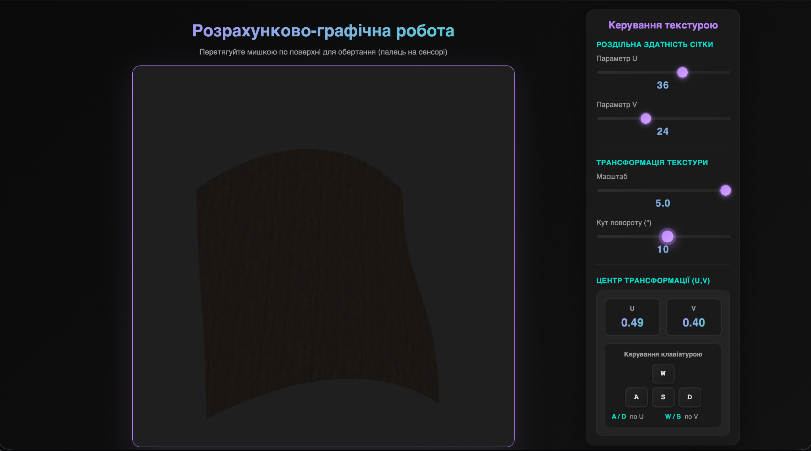

# Calculation and Graphics Work

---

**Student:** Striltsov Denys  
**Group:** TR-52mp  
**Discipline:** Visualization of Graphical and Geometric Information  
**Date:** December 17, 2025

---

## Chapter 1: Task Description

### 1.1 Overview

The purpose of this work is to develop an interactive WebGL application for visualizing a parametric surface of the "shoe surface" type with realistic texturing and lighting. The surface is generated procedurally based on parametric equations defined on the domain $u, v \in [0,1]$.

The application allows real-time interaction with the surface parameters, texture transformation, and lighting conditions. Special attention is paid to correct normal calculation and tangent space construction for normal mapping.

### 1.2 Functional Requirements

The application must fulfill the following requirements:

1. **Parametric Surface Visualization** – The surface is defined as:
   $$x = (u - 0.5) \cdot 2, \quad y = (v - 0.5) \cdot 2, \quad z = \frac{x^3}{3} - \frac{y^2}{2}$$

2. **Adjustable Mesh Resolution** – Parameters $u$ and $v$ can range from 10 to 50 subdivisions.

3. **Texture Coordinate Transformation** – Real-time scaling and rotation around an arbitrary center.

4. **Normal Mapping** – Implementation using tangent space (TBN matrix).

5. **Interactive Camera** – Trackball-style rotation using mouse input.

6. **Animated Lighting** – Light source moving along a circular trajectory.

### 1.3 Scope and Challenges

The main challenges of the task include:

- Correct computation of angle-weighted normals
- Stable calculation of tangents and bitangents with proper handedness
- Dynamic rebuilding of geometry when mesh resolution changes
- Correct implementation of texture coordinate transformations around an arbitrary center

---

## Chapter 2: Theoretical Framework

### 2. Theoretical foundations of implementation

#### 2.1 Parametric specification of the surface

The surface is specified by a parametric function of two variables:

$$
\mathbf{r}(u,v) = \bigl( x(u,v),\ y(u,v),\ z(u,v) \bigr),\quad u,v \in [0,1]
$$

In this work, the following analytical form of the surface is used:

$$
\begin{aligned}
x(u,v) &= 2(u - 0.5), \\
y(u,v) &= 2(v - 0.5), \\
z(u,v) &= \dfrac{[2(u - 0.5)]^3}{3} - \dfrac{[2(v - 0.5)]^2}{2}.
\end{aligned}
$$

After replacing $X = 2(u - 0.5)$, $Y = 2(v - 0.5)$ we get the classical form:

$$
z = \dfrac{X^3}{3} - \dfrac{Y^2}{2}
$$

This surface belongs to the class of **saddle-shaped** (hyperbolic paraboloid with cubic nonlinearity along the $X$ axis). It is characterized by:
- negative Gaussian curvature at most points,
- the presence of a saddle point in the center ($u=v=0.5$),
- pronounced asymmetry along the $u$ axis.

#### 2.2 Calculating Normals Taking into Account Angle-Weighted Normals

For high-quality illumination and smoothness of the surface, normals are calculated using the **angle-weighted vertex normals** method:

1. For each face (triangle), the plane normal vector is calculated using the vector product:

$$
\mathbf{N} = (\mathbf{P_2} - \mathbf{P_1}) \times (\mathbf{P_3} - \mathbf{P_1})
$$

2. For each vertex of the triangle, the angle at this vertex is determined (using the scalar product and arccosine).

3. The contribution of the face normal to the vertex normal is proportional to the angle at this vertex.

4. After accumulating all contributions for each vertex, normalization is performed:

$$
\mathbf{n} = \frac{\sum (\mathbf{N}_i \cdot w_i)}{\left\| \sum (\mathbf{N}_i \cdot w_i) \right\|},\quad w_i = \text{angle at vertex}
$$

This approach provides significantly better visual smoothness compared to simple averaging of normals of neighboring faces, especially on surfaces with different density of triangles and sharp corners.

#### 2.3 Construction of tangent space and normal mapping

To implement **normal mapping**, it is necessary to construct a local coordinate system (TBN — Tangent, Bitangent, Normal) for each vertex.

Calculation algorithm:

1. For each face, the vectors $\Delta\mathbf{P}_1$, $\Delta\mathbf{P}_2$ and $\Delta\mathbf{UV}_1$, $\Delta\mathbf{UV}_2$ are calculated from the vertex coordinates and texture coordinates.

2. The system of equations is solved:

$$
\mathbf{T}' = \mathbf{T} - \frac{\mathbf{T} \cdot \mathbf{N}}{\mathbf{N} \cdot \mathbf{N}}\mathbf{N}
$$

The matrix of the system is inverted, which gives $\mathbf{T}$ and $\mathbf{B}$.

3. The tangent $\mathbf{T}$ is orthogonalized with respect to the normal $\mathbf{N}$ using the Gram-Schmidt method:

$$
\mathbf{T}' = \mathbf{T} - (\mathbf{T}\cdot\hat{\mathbf{N}})\hat{\mathbf{N}}
$$

4. The **handedness** (the sign of the scalar product $\mathbf{B}$ with $\mathbf{N} \times \mathbf{T}'$) is preserved, which is necessary for the correct reconstruction of the bitangent in the shader.

5. In the fragment shader, the TBN matrix is ​​constructed:

$$
\mathbf{M}_{\text{TBN}} = \begin{bmatrix}
\mathbf{t}' & \mathbf{b}' & \mathbf{n}
\end{bmatrix}
$$

The normal from the texture is transformed from the range $[0,1]$ to $[-1,1]$ and applied:

$$
\mathbf{n}_{\text{world}} = \mathbf{M}_{\text{TBN}} \cdot (2 \cdot \text{texture}(u_{\text{normal}}, uv) - 1)
$$

#### 2.4 Transforming texture coordinates around an arbitrary center

To allow rotation and scaling of the texture around an arbitrary point $(u_c, v_c)$, the classical sequence of affine transformations is applied in the vertex shader:

$$
\begin{aligned}
\mathbf{uv}' &= (u,v) - (u_c, v_c) \\
\mathbf{uv}'' &= R(\theta) \cdot \mathbf{uv}' \\
\mathbf{uv}''' &= s \cdot \mathbf{uv}'' \\
\text{final}\ uv &= \mathbf{uv}''' + (u_c, v_c)
\end{aligned}
$$

where $R(\theta)$ is the rotation matrix by angle $\theta$:

$$
R(\theta) = \begin{pmatrix}
\cos\theta & -\sin\theta \\
\sin\theta & \cos\theta
\end{pmatrix}
$$

This approach allows the user to interactively manipulate the texture (scale, rotate, center shift) without overlapping edges and artifacts.

#### 2.5 Lighting model

A modified **Phong** model with **Blinn-Phong** elements is used:

- **Ambient lighting** — constant contribution of the diffuse color texture

$$
\text{ambient} = k_a \cdot \text{diffuseTex}
$$

- **Diffuse lighting** (Lambert) — using the normal from the normal map:

$$
\text{diffuse} = k_d \cdot \max(\mathbf{n} \cdot \mathbf{l}, 0) \cdot \text{diffuseTex}
$$

- **Specular reflection** — using the Blinn-Phong model using an inverted roughness texture:

$$
\text{specular} = k_s \cdot \left( \mathbf{n} \cdot \mathbf{h} \right)^{\text{shininess}} \cdot (1 - \text{roughnessTex})
$$

where $\mathbf{h}$ is a half-vector between the direction of the light source and the direction of the observer.

This combination allows you to obtain realistic lighting of a wooden surface with pronounced highlights and relief.

---

## Chapter 3: Implementation Details

### 3.1 Application Architecture

The application is implemented using pure **WebGL 1.0** and consists of the following modules:

| Module | Description |
|--------|-------------|
| `Model.js` | Generation of parametric geometry, normals, tangents, and buffers |
| `main.js` | WebGL initialization, input handling, uniform updates, and render loop |
| `shader.gpu` | Vertex and fragment shaders |
| `index.html` | User interface and control elements |

### 3.2 Geometry Generation

The surface is discretized into a regular grid in parameter space. Each rectangular cell is split into two triangles. Vertex positions, texture coordinates, indices, normals, and tangents are generated dynamically based on the selected resolution.

When the resolution changes, buffers are rebuilt to maintain stability and performance.

### 3.3 Shader Programs

**Vertex Shader:**
- Performs coordinate transformations
- Applies texture coordinate transformations
- Passes tangent space data to the fragment shader

**Fragment Shader:**
- Reconstructs the TBN matrix
- Applies normal mapping
- Computes lighting using the modified Phong model

### 3.4 Interaction and Controls

User interaction includes:
- Mouse-based camera rotation
- Slider-based parameter adjustment
- Keyboard-based movement of the texture transformation center

### 3.5 Textures

Three high-resolution textures are used:
- **Diffuse map** – Base color information
- **Roughness map** – Surface material properties
- **Normal map** – Surface detail enhancement

Textures are loaded asynchronously and mipmaps are generated for improved rendering quality.

---

## Chapter 4: User Instructions

### 4.1 System Requirements

- Modern web browser with WebGL support (Chrome, Firefox, Edge)
- Local web server to avoid CORS restrictions

### 4.2 Launch Instructions

1. Place all project files in a single directory
2. Start a local server:
```bash
   python -m http.server 8000
```
3. Open `http://localhost:8000` in a browser

### 4.3 Controls

| Action | Control |
|--------|---------|
| Camera rotation | Left mouse button + drag |
| Change U resolution | Slider "Parameter U" |
| Change V resolution | Slider "Parameter V" |
| Texture scale | Slider "Scale" |
| Texture rotation | Slider "Rotation Angle" |
| Move texture center (U) | Keys **A** / **D** |
| Move texture center (V) | Keys **W** / **S** |

### 4.4 Application Interface



**Figure 1** shows the main interface of the developed WebGL application. The central area displays the parametric surface with applied textures and lighting. The control panel on the right allows real-time adjustment of mesh resolution, texture transformation parameters, and transformation center. Keyboard controls are used to shift the texture transformation center along the UV coordinates.

---

## Chapter 5: Source Code Samples

### 5.1 Texture Coordinate Transformation (Vertex Shader)
```glsl
vec2 translated = texcoord - texCenter;
float c = cos(texAngle);
float s = sin(texAngle);
vec2 rotated = vec2(
    c * translated.x - s * translated.y,
    s * translated.x + c * translated.y
);
vec2 scaled = rotated * texScale;
vTexcoord = scaled + texCenter;
```

### 5.2 Normal Mapping with TBN (Fragment Shader)
```glsl
vec3 t = normalize(vTangent);
vec3 n = normalize(vNormal);
vec3 b = vHandedness * normalize(cross(n, t));
mat3 tbn = mat3(t, b, n);

vec3 normalMap = texture2D(u_normal, vTexcoord).rgb * 2.0 - 1.0;
vec3 normal = normalize(tbn * normalMap);
```

### 5.3 Keyboard Control of Texture Center
```javascript
const step = 0.01;
if (key === 'a') texCenterU -= step;
if (key === 'd') texCenterU += step;
if (key === 'w') texCenterV += step;
if (key === 's') texCenterV -= step;
```

---

## Conclusion

The project demonstrates practical application of computer graphics techniques including parametric surface generation, tangent space mathematics, and shader programming with WebGL.

---
